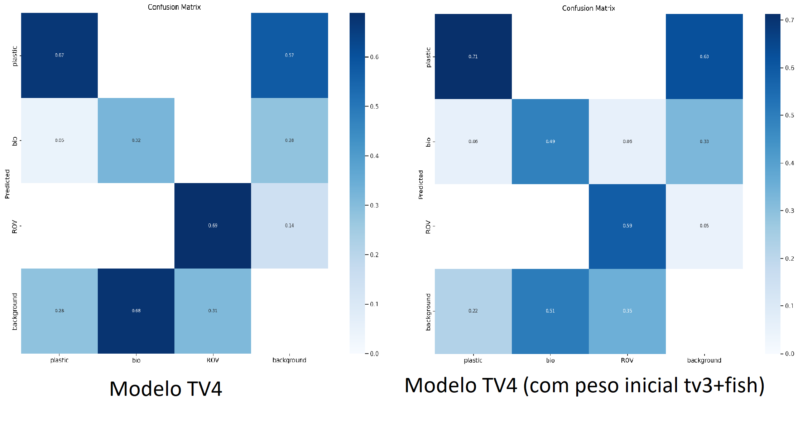

Matrizes de confusão :

Num olhar geral vemos que no modelo tv4 inicializado com os pesos apenas do yolo o modelo tende a dizer que é background quando na verdade temos bio com maior ocorrência que no modelo que foi inicializado com tv3+fish. No modelo inicializado com peso pré treinado tv3+fish vimos um comportamento de 51% dos casos onde a marcação era bio foi predito que era background e 49% dos casos que eram bio o modelo acertava. No modelo tv4 temos que 68% das vezes que a marcação era bio era predito back ground, ou seja, acertava apenas 32% das vezes. Isso é um pouco contra intuitivo quando olhamos o comportamento da métrica de validação MAP50 da classe bio que indicava 0,477 para tv4 e 0,166 para tv4 iniciado com tv3+fish. Com isso se fez interessante analisar como estava sendo detectado diretamente nas imagens com o intuito de fazer uma verificação mais visual.

Nesse caso acima fica mais fácil de visualizar que o primeiro modelo deixa de marcar algumas estrelas marinhas enquanto o segundo marca quantidade bem maior. 
